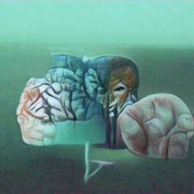
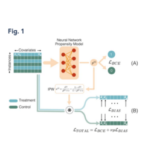
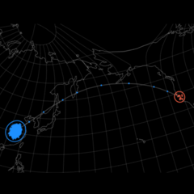
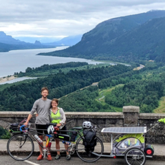
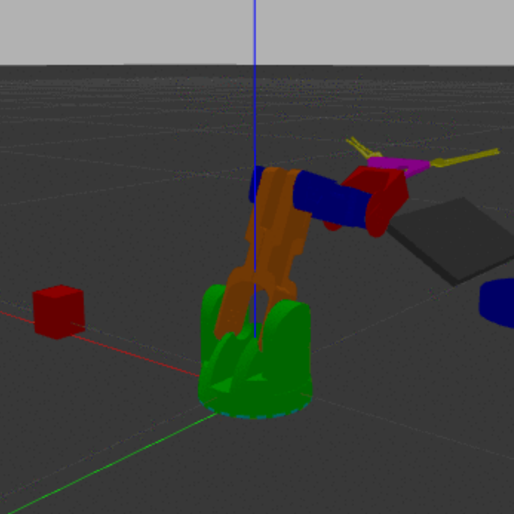
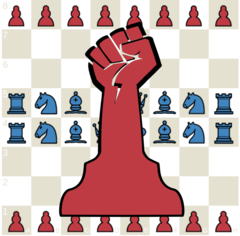
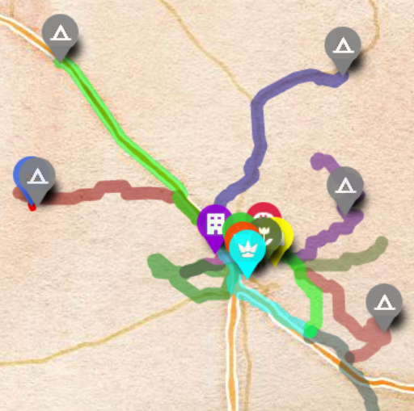
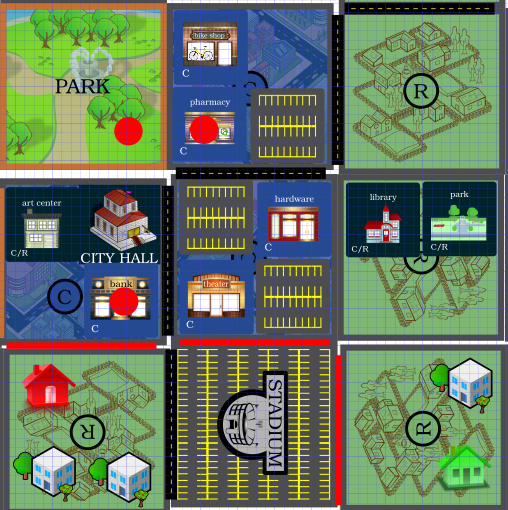

  <header class="intro" id="intro-link">
    

      
      <!-- current projects -->
      

        

          <h4>Highlighted Projects</h4>
        

      

      

        

          <a class="mytooltip" target="_blank" tlite="se" title="
modification of deep learning text-to-image algorithm BigSleep for generating hallucinatory videos from stories
" href="https://bonkerfield.org/2021/01/story2hallucination/"></a>
          <a class="mytooltip" target="_blank" tlite="se" title="
modification of deep learning text-to-image algorithm BigSleep for generating hallucinatory videos from stories
" href="https://bonkerfield.org/2021/01/story2hallucination/">
story2hallucination
</a>
          
<a target="_blank" href="https://bonkerfield.org/attention">sample</a>, <a target="_blank" href="https://bonkerfield.org/2021/01/story2hallucination/">writeup</a>

        

        

          <a class="mytooltip" target="_blank" tlite="se" title="
causal inference method using deep learning
" href="https://bmcmedresmethodol.biomedcentral.com/articles/10.1186/s12874-021-01383-x"></a>
          <a class="mytooltip" target="_blank" tlite="se" title="
causal inference method using deep learning
" href="https://bmcmedresmethodol.biomedcentral.com/articles/10.1186/s12874-021-01383-x">
BCAUS
</a>
          
<a target="_blank" href="https://bmcmedresmethodol.biomedcentral.com/articles/10.1186/s12874-021-01383-x">paper</a>

        

        

          <a class="mytooltip" target="_blank" tlite="se" title="
interactive dynamics model of virus transmission by international flights
" href="http://bl.ocks.org/stedn/b0acdeba81751c5f8e4ccaa74ccb09a9"></a>
          <a target="_blank" tlite="se" title="
interactive dynamics model of virus transmission by international flights
" href="http://bl.ocks.org/stedn/b0acdeba81751c5f8e4ccaa74ccb09a9"> 
virus flight model
</a>
          
<a target="_blank" href="http://bl.ocks.org/stedn/b0acdeba81751c5f8e4ccaa74ccb09a9">demo</a>, <a target="_blank" href="https://bonkerfield.org/2020/02/wuhan-virus-model/">writeup</a>

        

        

          <a class="mytooltip" target="_blank" tlite="se" title="
ebike and trailer carrying solar panels for traveling 5000 miles across US
" href="https://bonkerfield.org/2021/01/ebike-solar-trailer/"></a>
          <a target="_blank" tlite="se" title="
ebike and trailer carrying solar panels for traveling 5000 miles across US
" href="https://bonkerfield.org/2021/01/ebike-solar-trailer/">
solar ebike
</a>
          
<a target="_blank" href="https://bonkerfield.org/2021/01/ebike-solar-trailer/">blog</a>, <a target="_blank" href="https://docs.google.com/presentation/d/e/2PACX-1vS5_Nfz7WoQzMFzU_XxTa7ujMqZExpBKGCPobkhZegg6T-k7OQh3sQyeRlAdu-RIjd-eJAuFpO_NkEy/pub?start=false&loop=false&delayms=3000">presentation</a>

        

      

      

        

          <a class="mytooltip" target="_blank" tlite="se" title="
functioning robot and in silico simulation of vegetable sorting and slicing
" href="https://bonkerfield.org/2020/09/su-chef-slices/"></a>
          <a target="_blank" tlite="se" title="
functioning robot and in silico simulation of vegetable sorting and slicing
" href="https://bonkerfield.org/2020/09/su-chef-slices/">
robot chef
</a>
          
<a target="_blank" href="https://bonkerfield.org/2020/09/su-chef-slices/">writeup</a>

        

        

          <a class="mytooltip" tlite="se" target="_blank" title="
alternative rules of chess where the pawns rise up, complete with functional AI
" href="https://uprisingchess.web.app"></a>
          <a tlite="se" target="_blank" title="
alternative rules of chess where the pawns rise up, complete with functional AI
" href="https://uprisingchess.web.app">
uprising chess
</a>
          
<a target="_blank" href="https://uprisingchess.web.app">game</a>, <a target="_blank" href="https://solarpunk.blue/commentary/2021/10/09/uprising-chess.html">writeup</a>

        

        

          <a class="mytooltip" target="_blank" tlite="se" title="
physical model of embryonic cell shape change
" href="https://bonkerfield.org/2017/08/theseus-and-cell-phd-dissertation-story/"></a>
          <a class="mytooltip" target="_blank" tlite="se" title="
physical model of embryonic cell shape change
" href="https://bonkerfield.org/2017/08/theseus-and-cell-phd-dissertation-story/">
soft matter physics
</a>
          
<a target="_blank" href="https://bonkerfield.org/2017/08/theseus-and-cell-phd-dissertation-story/">blog</a>, <a target="_blank" href="https://journals.plos.org/ploscompbiol/article?id=10.1371/journal.pcbi.1005811">paper</a>

        

        

          <a class="mytooltip" target="_blank" tlite="se" title="
art+science collaboration creating compostable plastic sculptures of cellular morphology
" href="https://www.youtube.com/watch?v=j7szkheaqCY"></a>
          <a class="mytooltip" target="_blank" tlite="se" title="
art+science collaboration creating compostable plastic sculptures of cellular morphology
" href="https://www.youtube.com/watch?v=j7szkheaqCY">
filament findings
</a>
          
<a target="_blank" href="https://www.youtube.com/watch?v=j7szkheaqCY">video</a>

        

      

      <!-- current projects -->
      

        

          <h4>Current Projects</h4>
        

      

      

        

          <a class="mytooltip" tlite="se" title="
Solarpunk Travel Cooperative - reimagining the future of travel
" href="https://solarpunktravel.org"></a>
          <a class="mytooltip" tlite="se" title="
Solarpunk Travel Cooperative - reimagining the future of travel
" href="https://solarpunktravel.org">
solarpunk travel co-op
</a>
        

        

          <a class="mytooltip" tlite="se" title="
solarpunk.blue - to imagine a more equitable and sustainable world
" href="https://solarpunk.blue"></a>
          <a class="mytooltip" tlite="se" title="
solarpunk.blue - to imagine a more equitable and sustainable world
" href="https://solarpunk.blue">
solarpunk.blue
</a>
        

        <!-- 

          <a class="mytooltip" tlite="se" title="
Walkable - a board game about tranforming our cities and towns for a better future
" href="#"></a>
        
 -->
      

      <!-- resume -->
      

        

          <h4>Project Timeline
          <a href="https://bonkerfield.org/2020/05/timeline-streamgraph-google-sheet/">🛈</a></h4>
        

      

    

</header>

